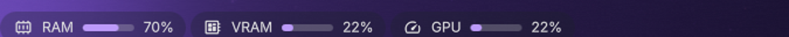

# GPU Monitor

NVIDIA GPU load as an animated progress bar in your [DankBar](https://github.com/AvengeMedia/DankMaterialShell), updated every second.



Shown next to its siblings [RAM Monitor](https://github.com/rollecode/dms-ram-monitor) and [VRAM Monitor](https://github.com/rollecode/dms-vram-monitor).

## What it does

- Compact bar pill: icon, optional label, animated progress bar and percentage
- Updates every second from `nvidia-smi --query-gpu=utilization.gpu`
- Fill follows your theme accent, turns orange above 75% and red above 90%

## Requirements

- NVIDIA GPU with the proprietary driver (`nvidia-smi` must be on PATH)

## The popout

Click the pill for per-process GPU load, biggest first, with a kill icon on each process.

Idle is pinned to the top in the accent colour. It comes from the GPU-wide utilisation rather than 100 minus the sum of the processes: unlike memory, per-process `sm%` does not partition, so those numbers do not add up to 100.

Each process shows a second, dimmer word where one can be resolved: the script for interpreters, the working directory for shells, the subprocess type for Electron apps. `nvidia-smi pmon` truncates its own command column and picks up argv, so names come from `/proc/<pid>/comm`.

The list is only collected while the popout is open.

## Installation

From the DMS plugin browser (Settings, Plugins tab, Browse), or manually:

```bash
git clone https://github.com/rollecode/dms-gpu-monitor ~/.config/DankMaterialShell/plugins/gpuMonitor
```

Then enable it in Settings, Plugins, and add the widget to your bar layout in Settings, Bar.

## Settings

- **Show label**: toggle the text label between the icon and the bar (on by default)
- **Label text**: customize the label (default `GPU`)
- **Entries to show**: how many rows the popout lists, 5 to 60 (default 30)

## License

MIT
